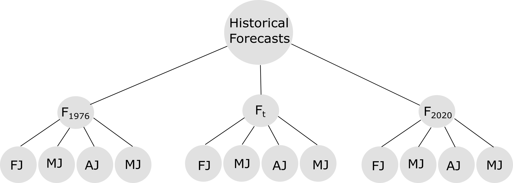

# Isabella WCM Update Forecast Generation Vignette
Daniel Hamill
10 January 2022

## Isabella Forecast Structure
The structure of the "official" Isabella forecasts analzed in this analysis is shown below. The historical forcasts from WY 1976 to WY 2020 were analyzed here.
  

  
<!--  -->

  

  
The forecast for a water year (<!-- $wy$ --> ) is described as a sequence month-to-July runoff projections for the calendar months ($t$), February (<!-- $FebJ$ --> ), March ($MarJ$), April (<!-- $AprJ$ --> ), and May (<!-- $MayJ$ --> ). The forecast window gets sucessivly smaller. A <!-- $FebJ$ -->  forcast has a 5-month forecast window (February - July), whereas a $MarJ$ forcast window has a 4-month forecast window (March to July).

<!-- $$
F_{wy,t} = [F_{wy,FebJ},  F_{wy, MarJ}, F_{wy, AprJ}, F_{wy, MayJ}]
$$ --> 

The difference between the forecasted runoff volumes <!-- $F_{wy, t}$ -->  and the observed runoff volume (<!-- $Obs_{wy,t}$ --> ) provides an estimate of forecast error (<!-- $E_{wy, t}$ --> ). 

<!-- $$
E_{wy, t} = F_{wy, t} - Obs_{wy,t}
$$ --> 

  
##  Data Transformation

In this section we describe the data analysis required to model the forcasts at Isabells for synthetic events.

### Forecasts
A historical analysis of the month-to-July runoff volume forecast () found the errors have a positive skew. The distributions of the z-scores (<!-- $Z_{wy} = \frac{F_{wy,t} - \bar{F_t}}{\sigma_{F_t}}$ --> ) of the untransformed (raw) month-to-July runoff volumes is shown below:
  

From a computation perspective, it is desirable to model the forecast runoff volumes as normally distributed. The [Box Cox power transformation](https://en.wikipedia.org/wiki/Power_transform#Box%E2%80%93Cox_transformation) was evaluated to determine if the normal assumption could be used in this forecast generation model. The Box Cox transformation is a fitted model that varies by the model parameter $\lambda$.  The model was fitted for each month-to-July using value obtained from maximum log-liklihood algorithim encoded within the python libarary [scipy](https://docs.scipy.org/doc/scipy/reference/reference/generated/scipy.stats.boxcox.html).

| Month-July    |   $\lambda$ |
|:----:|:------------:|
| FebJ | -0.134082   |
| MarJ | -0.00535718 |
| AprJ |  0.0590321  |
| MayJ |  0.102959   |

An example [probability plot](https://en.wikipedia.org/wiki/P%E2%80%93P_plot) of the untransformed (raw) and Box Cox transformed forecast runoff volumes the Feb-July forcast window is provided below.  The Box-Cox transformed values more closely follow the line of perfect agreement with a theoretical normal distribution.

The remaining probability plots for Mar-July, Apr-July, May-July all show similar results where the Box Cox transformed values closely follow the line of perfect agreementwith a theoretical normal distribution.
  
The distribution of the Box Cox transformed z-values also appear more normal than the untransformed (raw) runoff volumes shown above.
  

The statistical moments of the untransformed (raw) month-to-July and Box Cox transformed forecast runoff volumes are tabulated below.  

|     |   BoxCox  Kutrosis |      Skew |     Variance |     Mean |   Date2Volume   Kurtosios |     Skew |     Variance |     Mean |
|:----:|:--------------------------:|:---------------------:|:-------------------------:|:---------------------:|:-------------------------------:|:--------------------------:|:------------------------------:|:--------------------------:|
| Feb |                    -0.431 |                0.009 |                    0.008 |                6.131 |                          1.718 |                     1.375 |                   5.49e+10  |                  446422   |
| Mar |                    -0.613 |                0.001 |                    0.352 |               12.415 |                          0.981 |                     1.214 |                   8.96e+10 |                  461422   |
| Apr |                    -0.744 |               -0.011 |                    2.584 |               19.007 |                          0.543 |                     1.132 |                   1.05+11 |                  440222   |
| May |                    -0.655 |               -0.019 |                    9.800 |               25.245 |                          0.963 |                     1.253 |                   8.07e+10 |                  342489   |

Notably, the Box Cox transformred data have skew values close to zero, which suggest the transformed data can be modeled using a normal distribution. 

| Dataset     | Statistic   |           Value |
|:------------:|:------------:|:-----------------:|
| boxcox      | kurtosios   |     **-0.664**    |
|       | skew        |    **-0.002**  |
|       | variance    |      2.55641     |
|       | mean        |     14.262       |
| Date2Volume | kurtosios   |      1.746     |
|  | skew        |      1.404     |
|  | variance    |      6.072e+10 |
|  | mean        | 323663           |

## Forecast Generation Procedure

To simulate reservoir operatioins for Isabella Dam, the reservoir model requires the following inputs:

- Inflow Hydrograph
- Forecast Time Series
- Irrigation Demands

The inflow hydrographs are developed using the hydrologic sampler are are considered inputs to the forecast generation procedure. The forcast generation model described here is developed following an [autoregressive lag-1 (AR1)](https://otexts.com/fpp2/AR.html) model described by:

<!-- $$
F_{wy,t} = V_t + \phi(F_{wy, t-1} - V_t) + \varepsilon \sim \mathcal{N}(0,\,\sigma^{2}),
$$ --> 

The first term of the AR1 model ($V_t$) is the starting point for the calculation and is calculated directly from the inflow hydrograph. The second term of the AR1 equation is called the peristance term where the difference between the forecast from the previous month and current is scaled by the model parameter $\phi$.  An estimate of $\phi$ for each month-to July forcast is calculated as the lag-1 autocorrelation the time series of successive forcasts:

<!-- $$
\hat{\phi} = Corr(F_{t}, F_{t-1})
$$ --> 

Where 
- <!-- $\hat{\phi}$ -->  is a set of lag-1 correlation metrics for each month-to-July forcast window.
- <!-- $F_{t}$ -->  is the time series of all forcasts for the current forecast window.
- <!-- $F_{t-1}$ -->  is the time series of all forcasts from the previous forcast window.

By definition $\phi$ ranges between -1 and 1.  A value close to 1 indicates successive forecasts are similar in magnitude, whereas a value close to  -1 indicates the magnitudes are not related and an AR1 model might not be the best model.

The set of model parameters $\hat{\phi}$ can be thought as a set of sucssive lag-1 autocorrelation metrics.

<!-- $$
\hat{\phi} = [\phi_{FebJ}, \phi_{MarJ}, \phi_{AprJ}, \phi_{MayJ}]
$$ --> 

