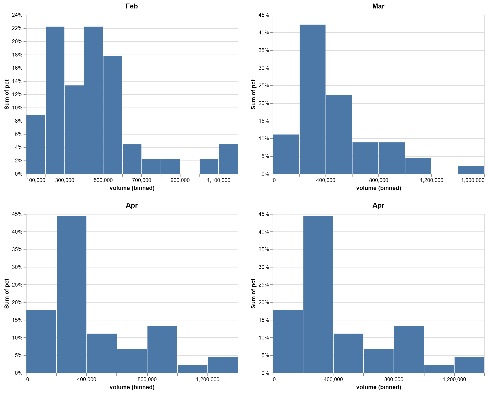
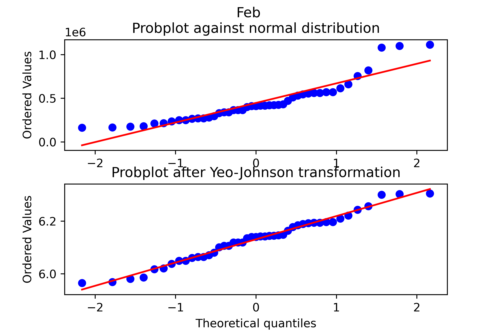
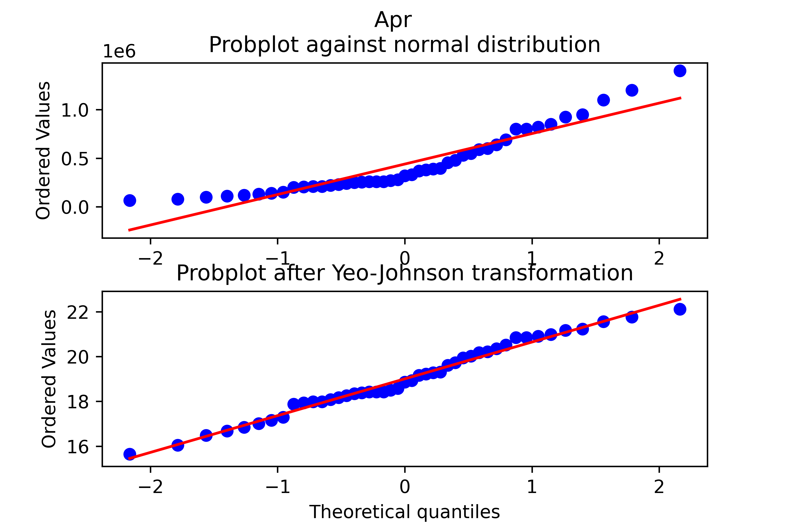
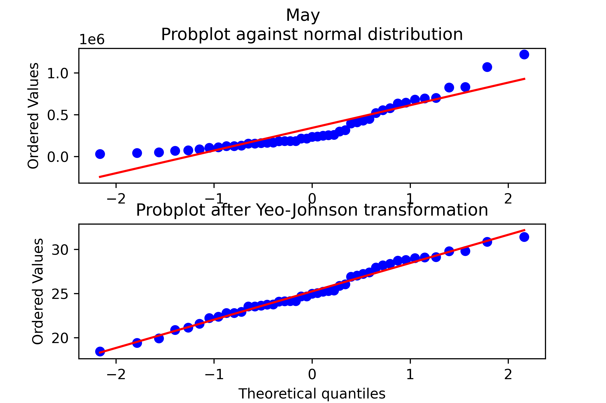

# Isabella WCM Update Forecast Generation Vignette
Daniel Hamill
10 January 2022

## Isabella Forecast Structure
The structure of the "official" Isabella forecasts analyzed in this analysis is shown below. The historical forecasts from WY 1976 to WY 2020 were analyzed here.

<center>

<!--  -->


</center>

The forecast for a water year ($wy$) is described as a sequence month-to-July runoff projections for the calendar months ($t$), February ($FebJ$), March ($MarJ$), April ($AprJ$), and May ($MayJ$). The forecast window gets successively smaller. A $FebJ$ forecast has a 5-month forecast window (February - July), whereas a $MarJ$ forcast window has a 4-month forecast window (March to July).  The sequence of forecast volumes for a water year can be described as:

$$
F_{wy,t} = [F_{wy,FebJ},  F_{wy, MarJ}, F_{wy, AprJ}, F_{wy, MayJ}]
$$

The difference between the forecasted runoff volumes $F_{wy, t}$ and the observed runoff volume ($Obs_{wy,t}$) provides an estimate of forecast error ($E_{wy, t}$).

$$
E_{wy, t} = F_{wy, t} - Obs_{wy,t}
$$

##  Data Transformation

In this section we describe the data analysis required to model the forecasts at Isabella for synthetic events.

### Forecasts
A historical analysis of the month-to-July runoff volume forecast () found the errors have a positive skew. The distributions of the z-scores ($Z_{wy} = \frac{F_{wy,t} - \bar{F_t}}{\sigma_{F_t}}$) of the untransformed (raw) month-to-July runoff volumes is shown below:


<center>

</center>

From a computation perspective, it is desirable to model the forecast runoff volumes as normally distributed. The [Box Cox power transformation](https://en.wikipedia.org/wiki/Power_transform#Box%E2%80%93Cox_transformation) was evaluated to determine if the normal assumption could be used in this forecast generation model. The Box Cox transformation is a fitted model that varies by the model parameter $\lambda$.  The model was fitted for each month-to-July using value obtained from maximum log-likelihood algorithm encoded within the python library [scipy](https://docs.scipy.org/doc/scipy/reference/reference/generated/scipy.stats.boxcox.html).


| Month-July    |   $\lambda$ |
|:----:|:------------:|
| FebJ | -0.134082   |
| MarJ | -0.00535718 |
| AprJ |  0.0590321  |
| MayJ |  0.102959   |


[Probability plots](https://en.wikipedia.org/wiki/P%E2%80%93P_plot) of the untransformed (raw) and Box Cox transformed forecast runoff provide a graphical assessment of the empirical data and any proposed transformations.  A probability plot consists of two series, 1) a cumulative distribution of specified theoretical distribution and 2) a cumulative distribution of the empirical data. The closer the data scale to following a 1:1 ratio, the closer the empirical data follow the specified theoretical distribution. For all month-to-July forecast windows, the Box-Cox transformed values more closely follow the line of perfect agreement with a theoretical normal distribution.


|  <!-- -->    |  <!-- -->   |
|:----:|:------------:|
|  |    |
| ||

The distribution of the Box Cox transformed z-values also appear more symmetrical (i.e. normal) than the untransformed (raw) runoff volumes shown above.

<center>

</center>

The statistical moments of the untransformed (raw) month-to-July and Box Cox transformed forecast runoff volumes are tabulated below.  

|     |   BoxCox<br /> Kurtosis |    <br /> Skew |   <br /> Variance |   <br /> Mean |   Date2Volume <br /> Kurtosis |   <br /> Skew |   <br /> Variance |   <br /> Mean |
|:----:|:--------------------------:|:---------------------:|:-------------------------:|:---------------------:|:-------------------------------:|:--------------------------:|:------------------------------:|:--------------------------:|
| Feb |                    -0.431 |                0.009 |                    0.008 |                6.131 |                          1.718 |                     1.375 |                   5.49e+10  |                  446422   |
| Mar |                    -0.613 |                0.001 |                    0.352 |               12.415 |                          0.981 |                     1.214 |                   8.96e+10 |                  461422   |
| Apr |                    -0.744 |               -0.011 |                    2.584 |               19.007 |                          0.543 |                     1.132 |                   1.05+11 |                  440222   |
| May |                    -0.655 |               -0.019 |                    9.800 |               25.245 |                          0.963 |                     1.253 |                   8.07e+10 |                  342489   |


Notably, the Box Cox transformed data have skew values close to zero, which suggest the transformed data can be modeled using a normal distribution.


| Dataset     | Statistic   |           Value |
|:------------:|:------------:|:-----------------:|
| boxcox      | kurtosis   |     **-0.664**    |
|       | skew        |    **-0.002**  |
|       | variance    |      2.55641     |
|       | mean        |     14.262       |
| Date2Volume | kurtosis   |      1.746     |
|  | skew        |      1.404     |
|  | variance    |      6.072e+10 |
|  | mean        | 323663           |

## Forecast Generation Procedure

To simulate reservoir operations for Isabella Dam, the reservoir model requires the following inputs:

- Inflow Hydrograph
- Forecast Time Series
- Irrigation Demands

The inflow hydrographs are developed using the hydrologic sampler are considered inputs to the forecast generation procedure. The forecast generation model described here is developed following an [autoregressive lag-1 (AR1)](https://otexts.com/fpp2/AR.html) model described by:

$$
F_{wy,t} = V_t + \phi(F_{wy, t-1} - V_t) + \varepsilon \sim \mathcal{N}(0,\,\sigma^{2})\,
$$

The first term of the AR1 model ($V_t$) is the starting point for the calculation and is calculated directly from the inflow hydrograph for the current month-to-July forecast window . The second term of the AR1 equation is called the persistence term where the difference between the forecast from the previous month and current is scaled by the model parameter $\phi$.  An estimate of $\phi$ for each month-to-July forecast is calculated as the lag-1 autocorrelation the time series of successive forecasts:

$$
\hat{\phi} = Corr(F_{t-1}, F_{t})
$$

Where
- $\hat{\phi}$ is a set of lag-1 correlation metrics for each month-to-July forecast window.
- $F_{t}$ is the time series of all forecasts for the current forecast window.
- $F_{t-1}$ is the time series of all forecasts from the previous forecast window.

By definition $\phi$ ranges between -1 and 1.  A value close to 1 indicates successive forecasts will scale following an a direct proportionality, whereas a value close to  -1 indicates forecast volumes scale following an inverse proportionality.  The set of model parameters $\hat{\phi}$ can be thought as a set of successive lag-1 autocorrelation metrics.

$$
\hat{\phi} = [\phi_{MarJ}, \phi_{AprJ}, \phi_{MayJ}]
$$

The forecast generation procedure is completed in the following steps.

1. Accept Event Seed from HEC-WAT
    - The seed allows for reproducible examples and used to initialize the random number generation for the forecast generation algorithm.
2. Generate a sequence of uniform numbers from a normal distribution.  By definition the uniform numbers range between 0 and 1 and can be thought as a probability. The random numbers are generated using a type of pseudorandom number generator described by the [Mersenne Twister](https://en.wikipedia.org/wiki/Mersenne_Twister) algorithm.

    $$
    random\_vals = [r_{init}, r_{FebJ}, r_{MarJ}, r_{AprJ}, r_{MayJ}]
    $$
3. Convert the generated random numbers from step 1 to inverse normal using the empirical algorithm. The values from this algorithm represent forecast volumes scales linearly by the $\sigma_t$ and $\mu_t$ (e.g. z-value).

    ```python
    #Get z-score from random variable
    # Inverse Normal distribution approximation (Z-score from cumulative probability)
    # https://www.johndcook.com/blog/python_phi_inverse/
    # based on algorithm given in "Handbook of Mathematical Functions" by Abramowitz and Stegun
    c = [2.515517, 0.802853, 0.010328]
    d = [1.432788, 0.189269, 0.001308]

    #note: log is base e by default if no base is specified
    if random_val < 0.5:
        t = (-2 * log(random_val)) ** 0.5
        num = (c[2] * t + c[1]) * t + c[0]
        den = ((d[2] * t + d[1]) * t + d[0]) * t + 1.0
        z = - (t - (num/den))
    else:
        t = (-2 * log(1.0 - random_val)) ** 0.5
        num = (c[2] * t + c[1]) * t + c[0]
        den = ((d[2] * t + d[1]) * t + d[0]) * t + 1.0
        z = (t - (num/den))
    ```
    When the inverse normal algorithm is ran for all of the $random\_vals$ from step 2, we have a sequence of inverse normal values.

    $$
    z\_vals = [z_{init}, z_{FebJ}, z_{MarJ}, z_{AprJ}, z_{MayJ}]
    $$

4. Calculate the a sequence of AR1 $z\_vals$.

    ```python
    auto_corr_z_vals = [0,0,0,0]
    for i in len(z_vals[1:]):
        if i == 0:
            #No persistance term for inital calculation
            val = z_{init} + random_error
            auto_corr_z_scores[i] = val
        else:
            #Include persistance term
            val = z_score[i] + phi_hat[i]*(z_vals[i] -z_vals[1+1]) + random_error
            auto_corr_z_scores[i] = val
    ```
5. Backtransform the AR(1) sequence of z-scores using the box-cox transformation described by:
    $$
    \begin{aligned}
    x &= (y\lambda + 1)^{1/\lambda} & \text{if $\lambda\ne0$}; \\
      &= 10^{y} & \text{if $\lambda=0$};
    \end{aligned}
    $$

6. Convert the backtransformed z-scores using $\mu_{t}$ and $\sigma_t$.

    $$
    F_{wy, t} = \bar{F_t} + Z_{wy,t} * \sigma_{t}
    $$
